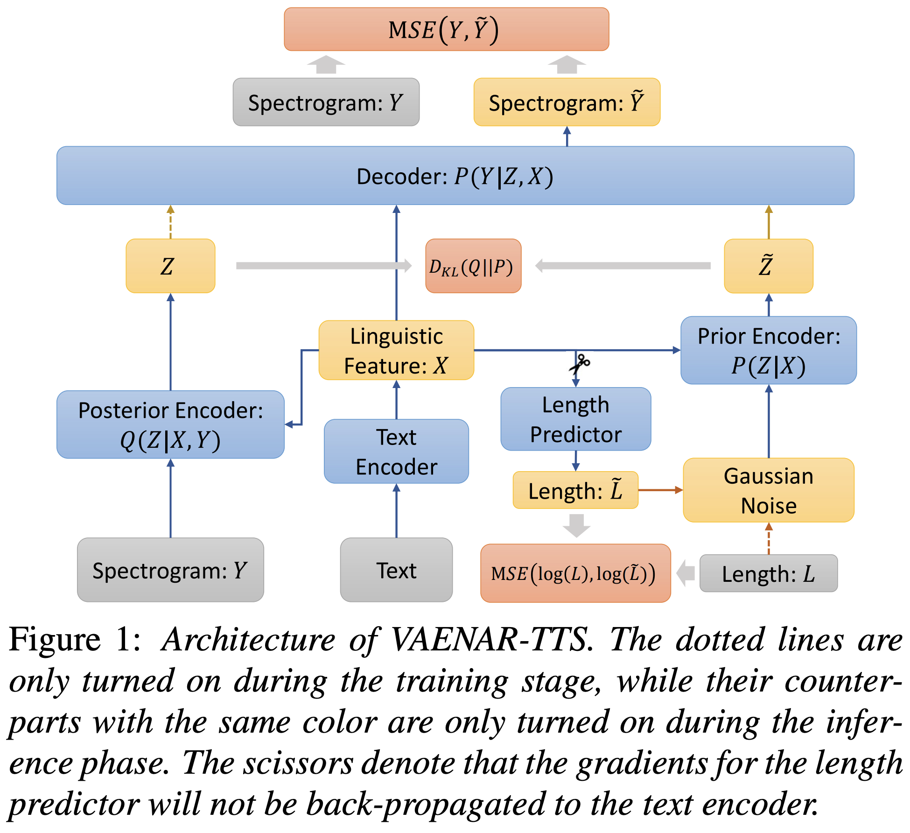
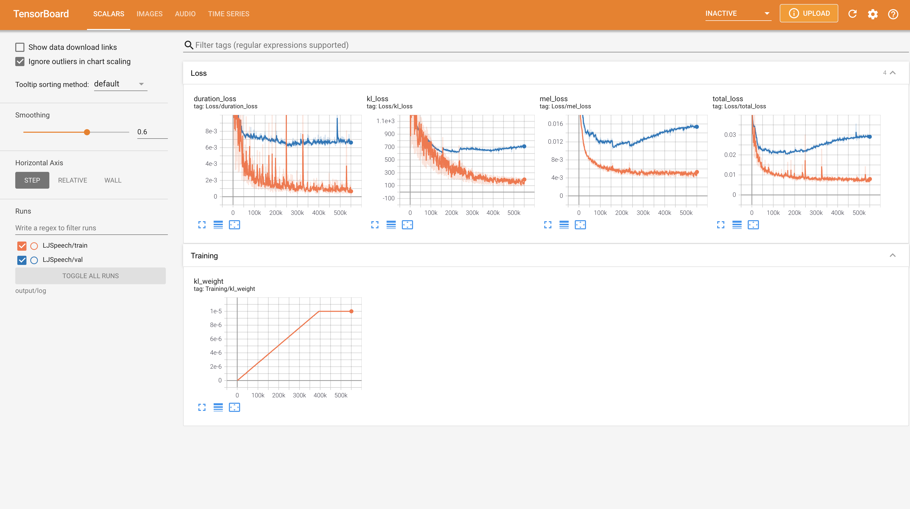
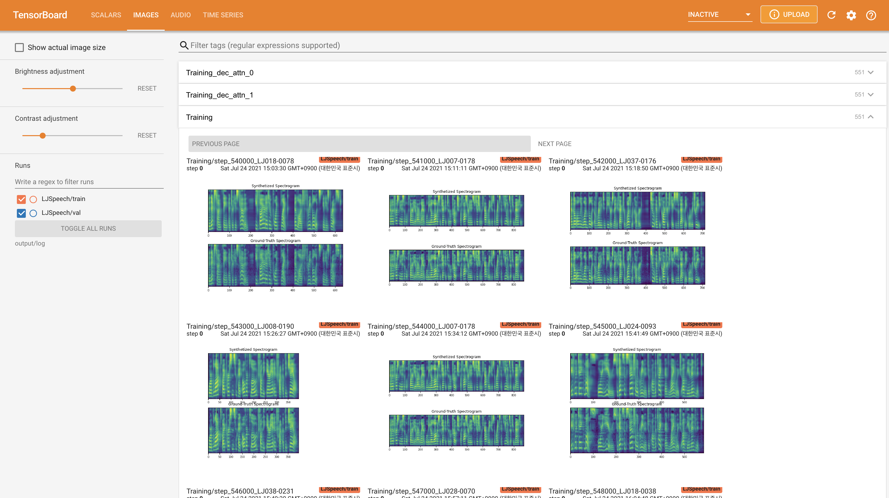
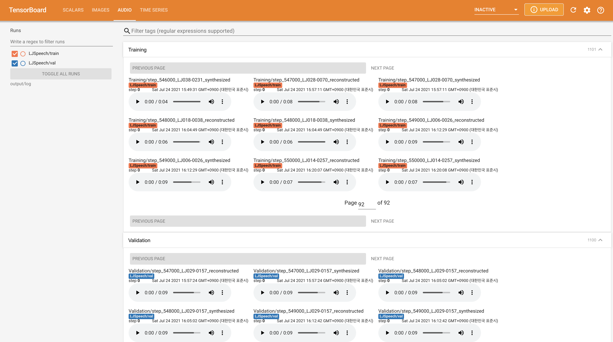

# VAENAR-TTS - PyTorch Implementation

PyTorch Implementation of [VAENAR-TTS: Variational Auto-Encoder based Non-AutoRegressive Text-to-Speech Synthesis](https://arxiv.org/abs/2107.03298). 

<p align="center">
    
</p>

The validation logs up to 70K of synthesized mel and alignment are shown below (LJSpeech_val_dec_attn_0_LJ029-0157 and LJSpeech_val_step_LJ029-0157 from top to bottom).

<p align="center">
    
</p>

<p align="center">
    
</p>

# Quickstart

## Dependencies
You can install the Python dependencies with
```
pip3 install -r requirements.txt
```

## Inference

You have to download the [pretrained models](https://drive.google.com/drive/folders/1-zgh0ltDHfjYT0i5xsNCjg-MsDDrhga7?usp=sharing) and put them in ``output/ckpt/LJSpeech/``.

For English single-speaker TTS, run
```
python3 synthesize.py --text "YOUR_DESIRED_TEXT" --restore_step RESTORE_STEP --mode single -p config/LJSpeech/preprocess.yaml -m config/LJSpeech/model.yaml -t config/LJSpeech/train.yaml
```
The generated utterances will be put in ``output/result/``.


## Batch Inference
Batch inference is also supported, try

```
python3 synthesize.py --source preprocessed_data/LJSpeech/val.txt --restore_step RESTORE_STEP --mode batch -p config/LJSpeech/preprocess.yaml -m config/LJSpeech/model.yaml -t config/LJSpeech/train.yaml
```
to synthesize all utterances in ``preprocessed_data/LJSpeech/val.txt``


# Training

## Datasets

The supported datasets are

- [LJSpeech](https://keithito.com/LJ-Speech-Dataset/): a single-speaker English dataset consists of 13100 short audio clips of a female speaker reading passages from 7 non-fiction books, approximately 24 hours in total.

## Preprocessing
 
First, run 
```
python3 prepare_align.py config/LJSpeech/preprocess.yaml
```
for some preparations. And then run the preprocessing script.
```
python3 preprocess.py config/LJSpeech/preprocess.yaml
```

## Training

Train your model with
```
python3 train.py -p config/LJSpeech/preprocess.yaml -m config/LJSpeech/model.yaml -t config/LJSpeech/train.yaml
```

# TensorBoard

Use
```
tensorboard --logdir output/log/LJSpeech
```

to serve TensorBoard on your localhost.
The loss curves, synthesized mel-spectrograms, and audios are shown.





# Implementation Issues

- Removed arguments, methods during converting Tensorflow to PyTorch: name, kwargs, training, get_config()
- Specify `in_features` in **LinearNorm** which is corresponding to `tf.keras.layers.Dense`. Also, `in_channels` is explicitly specified in **Conv1D**.
- get_mask_from_lengths() function returns logical not of that of FastSpeech2.
- In this implementation, the `griffin_lim` algorithms is used to convert a mel-spectrogram to a waveform. You can use **HiFi-GAN** as a vocoder by setting config, but you need to [train it from scratch](https://github.com/jik876/hifi-gan) (you cannot use the provided pre-trained **HiFi-GAN** model).

# Citation

```
@misc{lee2021vaenar-tts,
  author = {Lee, Keon},
  title = {VAENAR-TTS},
  year = {2021},
  publisher = {GitHub},
  journal = {GitHub repository},
  howpublished = {\url{https://github.com/keonlee9420/VAENAR-TTS}}
}
```

# References
- [thuhcsi's VAENAR-TTS](https://github.com/thuhcsi/VAENAR-TTS)
